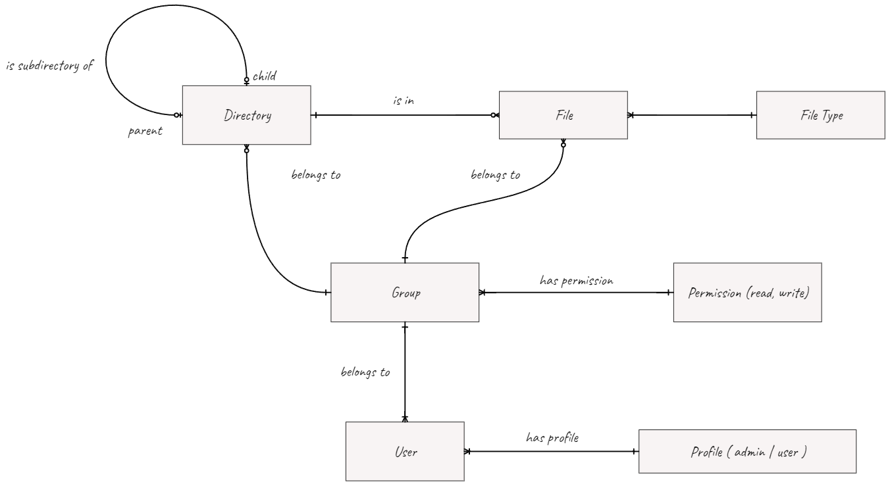

# File Management System

## 1. Casos de Uso

### 1.1. **Gerenciamento de Permissões de Arquivos e Pastas**

#### 1.1.1. **Criar Arquivo ou Pasta**

- **Ator Primário:** Usuário com permissão de escrita
- **Descrição:** O usuário cria um novo arquivo ou pasta no sistema de arquivos.
- **Fluxo Principal:**
  1. O usuário seleciona a opção de criar um novo arquivo ou pasta.
  2. O sistema cria o arquivo ou pasta no local especificado pelo usuário.
- **Pré-condições:** O usuário tem permissão de escrita no diretório onde deseja criar o arquivo ou pasta.

#### 1.1.2. **Editar Arquivo**

- **Ator Primário:** Usuário com permissão de escrita
- **Descrição:** O usuário modifica o conteúdo de um arquivo existente.
- **Fluxo Principal:**
  1. O usuário abre o arquivo que deseja editar.
  2. O usuário faz as alterações desejadas no conteúdo do arquivo.
  3. O sistema salva as alterações no arquivo.
- **Pré-condições:** O usuário tem permissão de escrita para o arquivo que deseja editar.

#### 1.1.3. **Excluir Arquivo ou Pasta**

- **Ator Primário:** Usuário com permissão de escrita
- **Descrição:** O usuário remove um arquivo ou pasta do sistema de arquivos.
- **Fluxo Principal:**
  1. O usuário seleciona o arquivo ou pasta que deseja excluir.
  2. O usuário confirma a exclusão.
  3. O sistema remove o arquivo ou pasta do sistema de arquivos.
- **Pré-condições:** O usuário tem permissão de escrita para o arquivo ou pasta que deseja excluir.

#### 1.1.4. **Mover Arquivo ou Pasta**

- **Ator Primário:** Usuário com permissão de escrita
- **Descrição:** O usuário move um arquivo ou pasta para um novo local no sistema de arquivos.
- **Fluxo Principal:**
  1. O usuário seleciona o arquivo ou pasta que deseja mover.
  2. O usuário seleciona o novo local de destino para o arquivo ou pasta.
  3. O sistema move o arquivo ou pasta para o novo local.
- **Pré-condições:** O usuário tem permissão de escrita para o arquivo ou pasta que deseja mover, bem como permissão de escrita para o diretório de
  destino.

#### 1.1.5. **Renomear Arquivo ou Pasta**

- **Ator Primário:** Usuário com permissão de escrita
- **Descrição:** O usuário altera o nome de um arquivo ou pasta no sistema de arquivos.
- **Fluxo Principal:**
  1. O usuário seleciona o arquivo ou pasta que deseja renomear.
  2. O usuário insere um novo nome para o arquivo ou pasta.
  3. O sistema renomeia o arquivo ou pasta.
- **Pré-condições:** O usuário tem permissão de escrita para o arquivo ou pasta que deseja renomear.

#### 1.1.6. **Visualizar Arquivo ou Pasta**

- **Ator Primário:** Usuário com permissão de leitura
- **Descrição:** O usuário visualiza o conteúdo de um arquivo ou pasta.
- **Fluxo Principal:**
  1. O usuário abre o arquivo ou pasta que deseja visualizar.
  2. O sistema exibe o conteúdo do arquivo ou lista os arquivos e subpastas dentro da pasta.
- **Pré-condições:** O usuário tem permissão de leitura para o arquivo ou pasta que deseja visualizar.

#### 1.1.7. **Copiar Arquivo ou Pasta**

- **Ator Primário:** Usuário com permissão de escrita/leitura
- **Descrição:** O usuário cria uma cópia de um arquivo ou pasta.
- **Fluxo Principal:**
  1. O usuário seleciona o arquivo ou pasta que deseja copiar.
  2. O usuário seleciona o local de destino para a cópia.
  3. O sistema cria uma cópia do arquivo ou pasta no local especificado.
- **Pré-condições:** O usuário tem permissão de escrita/leitura para o arquivo ou pasta que deseja copiar, bem como permissão de escrita para o
  diretório de destino.

#### 1.1.8. **Criar Link para Arquivo ou Pasta**

- **Ator Primário:** Usuário com permissão de escrita/leitura
- **Descrição:** O usuário cria um link para um arquivo ou pasta.
- **Fluxo Principal:**
  1. O usuário seleciona o arquivo ou pasta para o qual deseja criar um link.
  2. O usuário escolhe a opção para criar um link.
  3. O sistema gera um link para o arquivo ou pasta.
- **Pré-condições:** O usuário tem permissão de escrita/leitura para o arquivo ou pasta que deseja vincular.

#### 1.1.9. **Criar Atalho para Arquivo ou Pasta**

- **Ator Primário:** Usuário com permissão de escrita/leitura
- **Descrição:** O usuário cria um atalho para um arquivo ou pasta.
- **Fluxo Principal:**
  1. O usuário seleciona o arquivo ou pasta para o qual deseja criar um atalho.
  2. O usuário escolhe a opção para criar um atalho.
  3. O sistema cria um atalho para o arquivo ou pasta.
- **Pré-condições:** O usuário tem permissão de escrita/leitura para o arquivo ou pasta que deseja criar um atalho.

### 1.2. **Gerenciamento de Usuários e Grupos (Administração)**

#### 1.2.1. **Criar, Editar e Excluir Usuários**

- **Ator Primário:** Usuário com perfil de ADMINISTRADOR
- **Descrição:** O administrador cria, edita ou exclui usuários no sistema.
- **Fluxo Principal:**
  1. O administrador acessa a função de gerenciamento de usuários.
  2. O administrador cria um novo usuário, edita as informações de um usuário existente ou exclui um usuário.
- **Pré-condições:** O administrador está autenticado no sistema.

#### 1.2.2. **Atribuir Permissões para Usuários**

- **Ator Primário:** Usuário com perfil de ADMINISTRADOR
- **Descrição:** O administrador atribui permissões de leitura e escrita para um usuário específico.
- **Fluxo Principal:**
  1. O administrador acessa a função de atribuição de permissões.

  2. O administrador seleciona o usuário para o qual deseja atribuir permissões.
  3. O administrador define as permissões de leitura e escrita para o usuário selecionado.
- **Pré-condições:** O administrador está autenticado no sistema.

#### 1.2.3. **Criar, Editar e Excluir Grupos**

- **Ator Primário:** Usuário com perfil de ADMINISTRADOR
- **Descrição:** O administrador cria, edita ou exclui grupos no sistema.
- **Fluxo Principal:**
  1. O administrador acessa a função de gerenciamento de grupos.
  2. O administrador cria um novo grupo, edita as informações de um grupo existente ou exclui um grupo.
- **Pré-condições:** O administrador está autenticado no sistema.

#### 1.2.4. **Atribuir Permissões para Grupos**

- **Ator Primário:** Usuário com perfil de ADMINISTRADOR
- **Descrição:** O administrador atribui permissões de leitura e escrita para um grupo específico.
- **Fluxo Principal:**
  1. O administrador acessa a função de atribuição de permissões.
  2. O administrador seleciona o grupo para o qual deseja atribuir permissões.
  3. O administrador define as permissões de leitura e escrita para o grupo selecionado.
- **Pré-condições:** O administrador está autenticado no sistema.

#### 1.2.5. **Adicionar e Remover Usuários de Grupos**

- **Ator Primário:** Usuário com perfil de ADMINISTRADOR
- **Descrição:** O administrador adiciona ou remove usuários de um grupo específico.
- **Fluxo Principal:**
  1. O administrador acessa a função de gerenciamento de grupos.
  2. O administrador seleciona o grupo ao qual deseja adicionar ou remover usuários.
  3. O administrador adiciona ou remove os usuários desejados do grupo.
- **Pré-condições:** O administrador está autenticado no sistema.

### 1.3. **Herança de Permissões**

#### 1.3.1. **Herança de Permissões de Diretórios**

- **Descrição:** As permissões concedidas para um usuário em um diretório serão herdadas por subdiretórios, a menos que uma permissão específica
  seja definida para o subdiretório.
- **Fluxo Principal:**
  1. As permissões concedidas para um diretório são automaticamente aplicadas aos subdiretórios.
  2. Se uma permissão específica for definida para um subdiretório, ela terá prioridade sobre a permissão herdada.
- **Pré-condições:** O sistema de arquivos possui uma estrutura de diretórios onde as permissões podem ser aplicadas.

